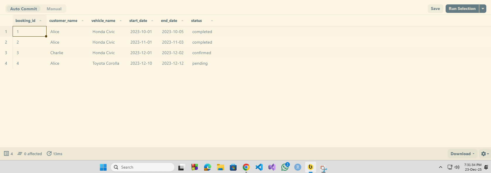
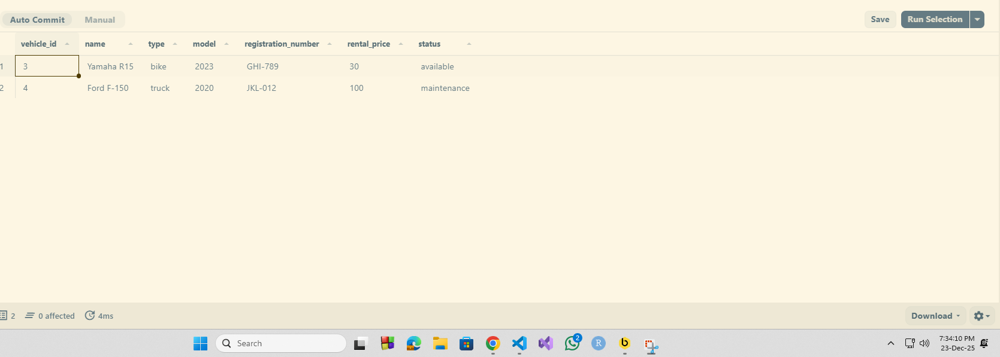
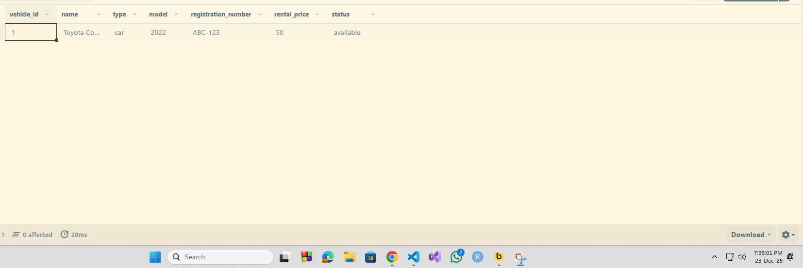
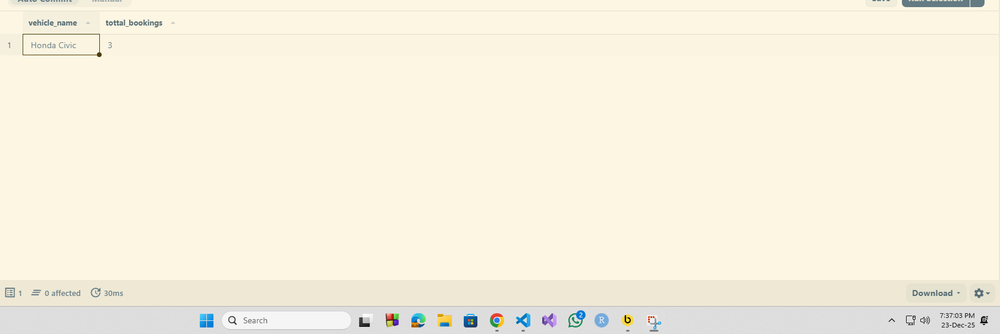

# Vehicle Rental System - SQL Queries

This document contains SQL queries for managing a vehicle rental system database.

## Database Schema Overview

The system consists of three main tables:

- **users**: Stores customer information
- **vehicles**: Contains vehicle details and availability status
- **booking**: Manages rental bookings with foreign keys to users and vehicles

---

## Query 1: JOIN Operations

**Requirement:** Retrieve booking information along with customer name and vehicle name.

**Description:**  
This query combines data from three tables (`booking`, `users`, and `vehicles`) using INNER JOIN operations. It retrieves comprehensive booking information including customer details and vehicle information for all active bookings.

**SQL Query:**

```sql
select
    booking.booking_id,
    users.name as customer_name,
    vehicles.name as vehicle_name,
    booking.start_date,
    booking.end_date,
    booking.status
from booking
inner join users using(user_id)
inner join vehicles using(vehicle_id);
```



**Key Features:**

- Uses `using` clause for cleaner join syntax on common column names
- Returns customer and vehicle names instead of ids for better readability
- Includes booking dates and status for complete information

---

## Query 2: EXISTS Subquery

**Requirement:** Find all vehicles that have never been booked.

**Description:**  
This query identifies all vehicles in the inventory that have no booking history. It uses the `NOT EXISTS` clause with a correlated subquery to filter out vehicles that appear in the booking table.

**SQL Query:**

```sql
select
    vehicle_id,
    name,
    type,
    model,
    registration_number,
    rental_price,
    availability_status as status
from vehicles
where not exists (
    select *
    from booking
    where booking.vehicle_id = vehicles.vehicle_id
)
order by vehicle_id asc;
```



**Key Features:**

- Uses `not exists` for efficient filtering
- Orders results by vehicle_id for easy reference
- Useful for identifying underutilized inventory

---

## Query 3: WHERE Filtering

**Requirement:** Retrieve all available vehicles of a specific type (e.g., cars).

**Description:**  
This query filters the vehicles table to display only cars that are currently available for rent. It demonstrates the use of multiple conditions in a WHERE clause.

**SQL Query:**

```sql
select *
from vehicles
where type = 'car'
  and availability_status = 'available';
```



**Key Features:**

- Combines multiple filter conditions using and operator
- Filters by both vehicle type and availability status
- Returns all columns for matching vehicles

---

## Query 4: GROUP BY and HAVING

**Requirement:** Find the total number of bookings for each vehicle and display only those vehicles that have more than 2 bookings.

**Description:**  
This query analyzes booking frequency by vehicle, identifying popular vehicles with more than 2 bookings. It demonstrates the use of aggregation functions, grouping, and post-aggregation filtering.

**SQL Query:**

```sql
select
    name as vehicle_name,
    count(*) as total_bookings
from vehicles
inner join booking using(vehicle_id)
group by name
having count(*) > 2;
```



**Key Features:**

- Uses `count(*)` to aggregate booking frequency
- `group by` organizes results by vehicle name
- `having` clause filters groups after aggregation (only vehicles with more than 2 bookings)
- Useful for identifying high-demand vehicles

---

## Notes

- All queries assume proper foreign key relationships between tables
- The `using` clause is used where column names are identical across joined tables
- Queries are ordered from basic to advanced sql concepts
